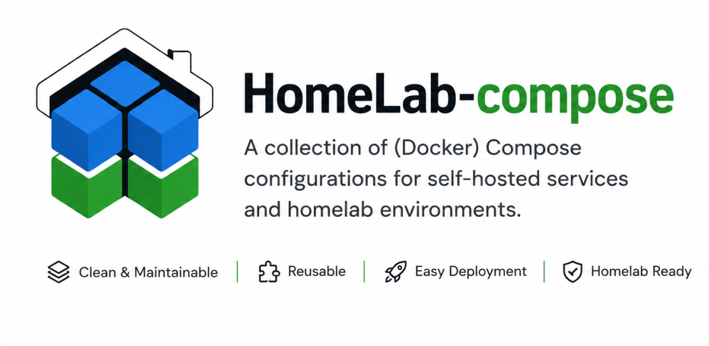

# HomeLab-compose

A collection of (Docker) Compose configurations for self-hosted services and homelab environments.




## Overview

This repository contains Compose stacks for running and maintaining various self-hosted applications. Each service is organized in its own directory and can be deployed independently.

The goal is to provide:

* Clean and maintainable Compose configurations
* Reusable service definitions
* Simple deployment and updates
* A central place for homelab infrastructure

### Disclaimer:
This is currently (June 2026) a work in progress project. I have no timeline or roadmap (just to be honest).
Stay tuned :)


## Repository Structure

```text
.
├── service-a/
│   ├── compose.yaml
│   ├── .env.example
│   └── README.md
├── service-b/
│   ├── compose.yaml
│   └── README.md
└── README.md
```

Each service directory should contain:

* `compose.yaml` – Compose configuration
* `.env.example` – Example environment variables (optional)
* `README.md` – Service-specific documentation


## Included Compose Configurations

| Service | Desc | README |
|---------|--------|--------|
| poly-php |portable Docker‑Entwicklungsumgebung zum gleichzeitigen Testen mehrerer PHP‑Versionen| [poly-php/README.md](poly-php/README.md) |
| adguard | Compose-Projekt für den Betrieb von AdGuard Home im HomeLab | [adguard/README.md](adguard/README.md) |


## Getting Started

1. Clone the repository.

```bash
git clone https://github.com/clavicarius/homelab-compose.git
cd homelab-compose
```

2. Navigate to the desired service.

```bash
cd <service>
```

3. Copy the example environment file if available.

```bash
cp .env.example .env
```

4. Start the stack.

```bash
docker compose up -d
```

## Conventions

* One service per directory
* Keep secrets out of version control
* Provide a README for every service
* Prefer named volumes for persistent data
* Pin image versions whenever possible

## License

This repository is licensed under the MIT License.
